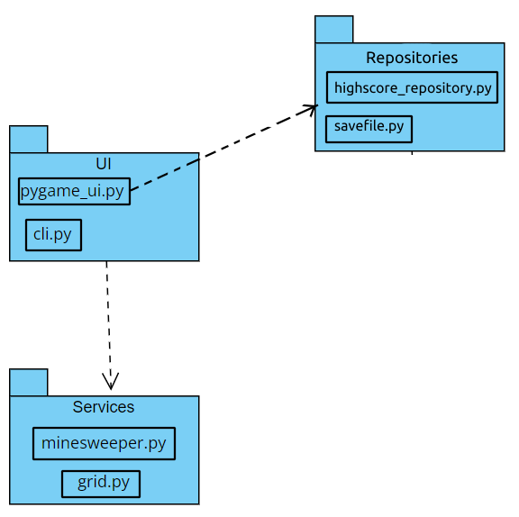
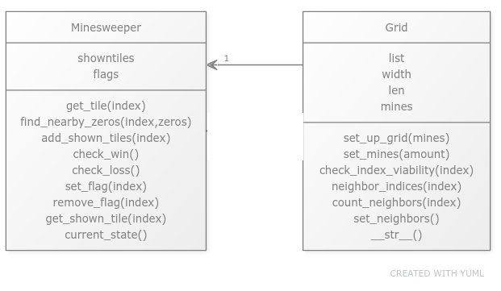
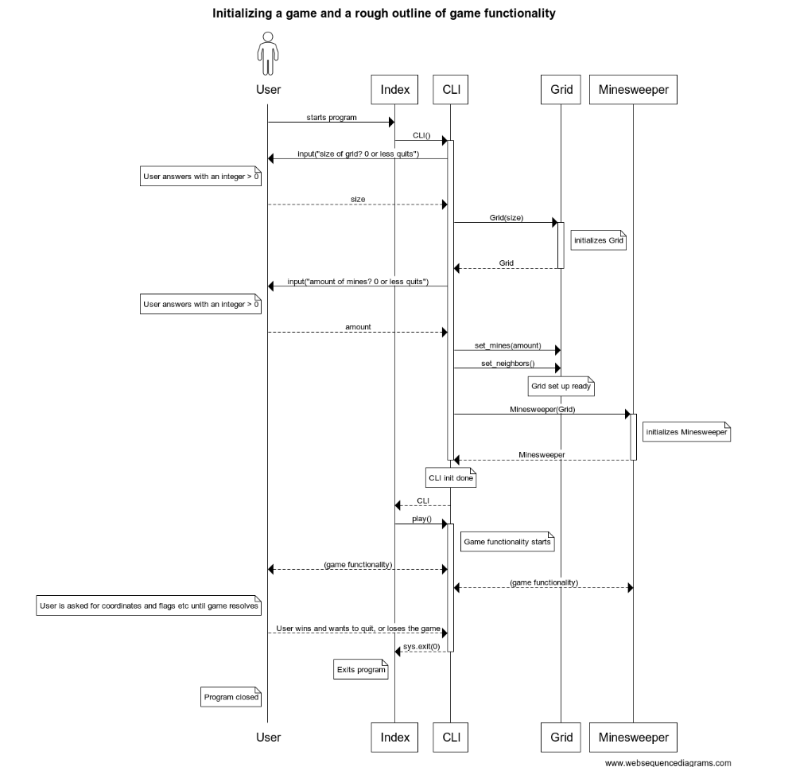

## Rakenne

Ohjelman rakenne on eriytetty kahteen hakemistoon, UI ja Services.

UI sisältää kaksi vaihtoehtoista käyttöliittymää, joista pygame_ui.py on graafinen ja cli.py sisältää komentorivikäyttöliittymän. Kumpikin näistä riippuu Services-hakemistossa olevista luokista.

Services sisältää sovelluslogiikkaan kuuluvat luokat Minesweeper ja Grid, sekä tiedoston errors jossa on näihin kuuluvat exceptionit.

## Käyttöliittymä

### GUI / Graafinen

Tällä hetkellä graafinen käyttöliittymä piirtää 10x10-peliruudukon ja ei ole muita erillisiä näkymiä.

### CLI / Komentorivi

Komentorivikäyttöliittymässä on yksi näkymä ja kysytään käyttäjältä syötettä.

## Sovelluslogiikka

Sovelluslogiikan luokkia ovat Grid ja Minesweeper.

Grid kuvaa ennen pelin aloittamista tehtyä peliruudukkoa johon on asetettu miinat ja laskettu miinojen vieressä oleville ruuduille naapurimiinojen määrä.

Minesweeper sisältää pelitilanteeseen kuuluvat toiminnallisuudet kuten liput ja näytettävien ruutujen indeksit sekä näiden muokkaamisen sekä pelin voiton tarkistamisen.

## Toiminnallisuudet

### Komentorivikäyttöliittymä

Sekvenssikaavio komentorivikäyttöliittymä-pelin ruudukon ja pelin (Minesweeper) alustamisesta, sekä karkea luonnos sen pelitoiminnallisuudesta ja luokkien suhteista kun CLI.play() suoriutuu eli peli on käynnissä.

