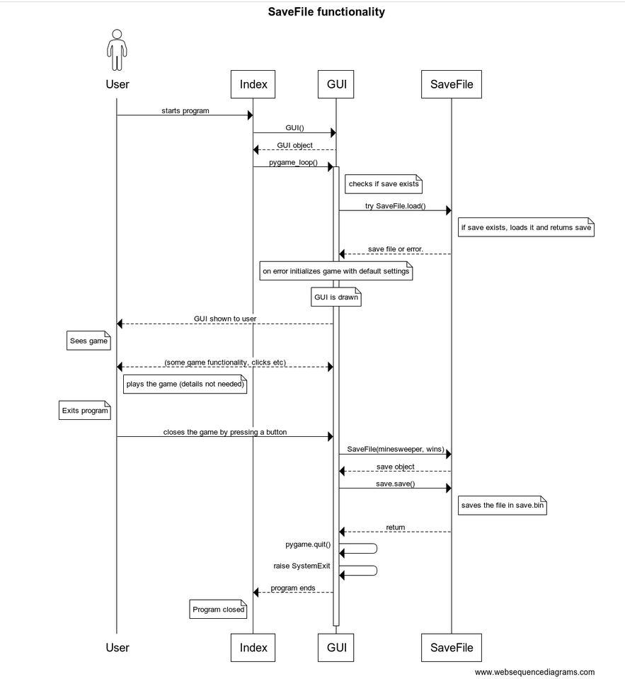

## Rakenne

Ohjelman rakenne on eriytetty kolmeen hakemistoon, UI, Repositories ja Services.

UI sisältää kaksi vaihtoehtoista käyttöliittymää, joista pygame_ui.py on graafinen ja cli.py sisältää komentorivikäyttöliittymän. Kumpikin näistä riippuu Services-hakemistossa olevista luokista.

Services sisältää sovelluslogiikkaan kuuluvat luokat Minesweeper ja sen hyödyntämän luokan Grid, sekä tiedoston errors jossa on näihin kuuluvat exceptionit.

Vain pygame_ui:ssa oleva GUI-luokka eli graafinen käyttöliittymä hyödyntää Repositories-kansiossa olevaa pysyväistallennukseen liittyvää koodia.

## Käyttöliittymä

### GUI / Graafinen

Pelin avatessa graafinen käyttöliittymä piirtää 10x10-peliruudukon.
Käyttöliittymässä on oikealla nappeja, joista pelin voi aloittaa alusta, sulkea tai vaihtaa sovelluksessa olevan pelin kokoa.
Käyttöliittymässä näkyy myös kolme parasta voittoputkea sekä pelitilanteeseen liittyviä tietoja.

Kun nappeja painetaan tai peliruudukon kanssa interaktoidaan, näkyy uusi pelinäkymä heti, kuvastaen sen hetkistä pelitilannetta. Näkymä renderöityy uusiksi koko ajan.

### CLI / Komentorivi

Komentorivikäyttöliittymässä on yksi näkymä ja siinä kysytään käyttäjältä syötettä, jonka jälkeen tulostetaan sen hetkinen pelitilanne.

## Sovelluslogiikka

Sovelluslogiikan luokkia ovat Grid ja Minesweeper.

Grid kuvaa ennen pelin aloittamista tehtyä peliruudukkoa johon on asetettu miinat ja laskettu miinojen vieressä oleville ruuduille lähellä olevien miinojen määrä.

Minesweeper sisältää pelitilanteeseen kuuluvat toiminnallisuudet kuten liput ja näytettävien ruutujen indeksit sekä näiden muokkaamisen sekä pelin voiton tarkistamisen.

## Tietojen pysyväistallennus

Pakkauksen `Repositories` luokat `SaveFile` ja `HighscoreRepository` tallentavat tietoa kun käyttäjä pelaa graafista versiota pelistä.

`SaveFile` tallentaa pelitilanteen binääritiedostoksi kun peli suljetaan.

`HighscoreRepository` pitää kirjaa SQLite-tietokantaan voittoputkista. Jokaisella rivillä on käyttäjän nimi (tällä hetkellä vain "User") sekä käyttäjän toiminnasta tallennettu voittoputken pituus. Tulokset palautetaan aina järjestyksessä suurimmasta pienimpään.

Alla olevassa kuvassa pääpiirteittäin pelitilan tallennukseen liittyvä toiminnallisuus sekvenssikaaviona. Kaaviossa ei oteta huomioon eri tilanteita joissa pelitallennus poistetaan.

## Toiminnallisuudet

Kuvataan muutama toiminnallisuus sekvenssikaavioina ja tekstillä.

### Graafinen käyttöliittymä

Käyttäjä voi klikata hiirellä peliruudukkoa ja onnistuneesti pelata pelejä.

### Komentorivikäyttöliittymä

Sekvenssikaavio komentorivikäyttöliittymä-pelin ruudukon ja pelin (Minesweeper) alustamisesta, sekä karkea luonnos sen pelitoiminnallisuudesta ja luokkien suhteista kun CLI.play() suoriutuu eli peli on käynnissä.

Tässä näkyvä Index viittaa cli_index.py -tiedostoon.

## Ohjelman rakenteeseen jääneet heikkoudet

Graafisen käyttöliittymän koodia voisi refaktoroida siistimmäksi ja ehkä eriyttää osa funktioista luokkaan, sillä nyt tiedosto on melko pitkä.