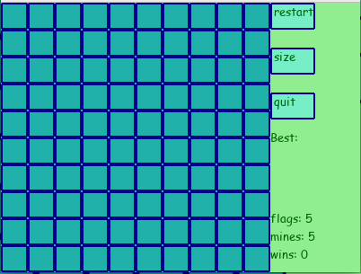
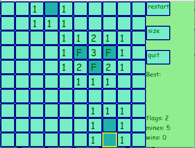
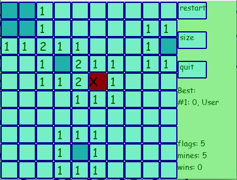

# Miinaharava GUI käyttöohje

Aloita lataamalla projektin viimeisimmän [releasen](https://github.com/Deeroil/ot-harjoitustyo/releases) lähdekoodi lataamalla _Assets_-osion alta _Source code_.

Linkki komentorivikäyttöliittymän käyttöohjeeseen [tässä](https://github.com/Deeroil/ot-harjoitustyo/blob/master/dokumentaatio/kayttoohje_cli.md)

## Konfigurointi

Ohjelman luoman tietokannan ja pelitallennustiedoston nimet voi halutessaan konfiguroida *.env*-tiedoston avulla. Tiedostot luodaan automaattisesti *data*-hakemistoon, jos niitä ei ole vielä.

```
SAVE_FILENAME=save.bin
DATABASE_FILENAME=highscores.db
```

Testaukseen käytettävien tiedostojen nimet voi konfiguroida samalla tavalla *.env.test* -tiedostossa.

## Asentaminen ja käynnistäminen

Ensin asenna riippuvuudet komennolla:

```
poetry install
```

Jos et ole suorittanut ohjelman tätä versiota aiemmin, aloita alustamalla tietokanta komennolla

```
poetry run invoke build
```

Tämän jälkeen GUI-versio ohjelmasta käynnistetään komennolla 

```
poetry run invoke start
```

Aukeaa uusi ikkuna, jossa on peliruudukko ja peli voi alkaa.

## Miinaharava

### Tavoite

Pelin tavoitteena on selviytyä miinakentästä avaamalla ruutuja, jotta voi päätellä ja merkitä lipulla ruudut joissa on miina. Peli päättyy heti jos osutaan miinaan. Jos ruudussa ei ole miinaa, näkyy ruudussa numero, joka kertoo kuinka monta miinaa on kyseistä ruutua ympäröivissä ruuduissa yhteensä. Peli voitetaan merkitsemällä kaikki miinat lipuilla tai avaamalla kaikki ruudut joissa ei ole miinaa.

### Pelin toiminta

Tällä hetkellä ohjelma aukeaa suoraan näyttäen 10x10-kokoisen peliruudukon, jossa on piilossa 5 miinaa. Muun kokoisia ruudukoita ei ole vielä mahdollista valita.

Käyttäjä voi avata ruudun klikkaamalla hiiren vasenta painiketta ruudun päällä. Kun hiiri on ruudun päällä, sen reunat ovat keltaiset. Klikatessa ruutua sen alta paljastuu joko miina, jolloin peli päättyy häviöön, tai numero, joka merkitsee viereisissä ruuduissa olevien miinojen määrää.

Avaamattoman ruudun voi merkitä lipulla painaen hiiren oikealla painikkeella. Lippu (F) kuvastaa ruutua, jonka alla pelaaja uskoo olevan miina.
Samalla tavalla uudestaan klikkaamalla voi poistaa lipun ruudusta. Lippuja voi asettaa yhteensä yhtä monta kuin miinoja on ruudukossa.

Peli voitetaan jos kaikki miinat saadaan merkittyä oikein lipuilla ilman että osutaan miinaan tai avataan kaikki ruudut joissa ei ole miinaa. Peli alkaa alusta hetken kuluttua.

Peli hävitään jos pelaaja avaa ruudun, jossa oli miina. Tällöin peli alkaa alusta hetken kuluttua.

### Sivupalkki

Sivupalkissa on kolme nappia:

Restart (aloita alusta): Aloittaa pelin alusta. Tällöin myös menettää mahdollisen voittoputken.

Size (koko): Vaihtaa ruudukon koon oletuskoosta 10x10-ruudukoksi jossa on 10 miinaa.

Quit (lopeta): Lopettaa pelin ja tallentaa samalla pelitilanteen. 

Peli pitää kirjaa peräkkäisistä voitoista, ja näyttää parhaimmat 3 voittoputkea sivupalkissa.

Näiden alapuolella on vielä jäljellä olevien lippujen määrä, miinojen määrä ruudukossa sekä tämänhetkisen voittoputken pituus.


## Ohjeita tukevia kuvia

Pelin alkutilanne, avaamaton 10x10 -ruudukko.
Ohjekuvissa näkyvässä pelissä on vain 5 miinaa.
Oikealla sivupalkki. Listaa parhaista tuloksista ei näy, sillä yhtään peliä ei olla pelattu.



Seuraavaa kuvaa varten on avattu ruutuja, ja merkitty kolme ruuduista lipulla (F). Vaaleammat ruudut on avattuja.

Hiiren kursori on alhaalla olevan ruudun päällä, sen näkee keltaisista reunoista.



Viimaisessä pelissä ollaan ensin voitettu yksi peli, ja sitten avataan ruutu jossa on miina ja peli hävitään.
Tämän jälkeen peli alkaa pian automaattisesti alusta.
(Pelin aikana näkyi voittoputkessa 1, mutta häviämishetkellä voittoputki päivittyy nollaksi.)



