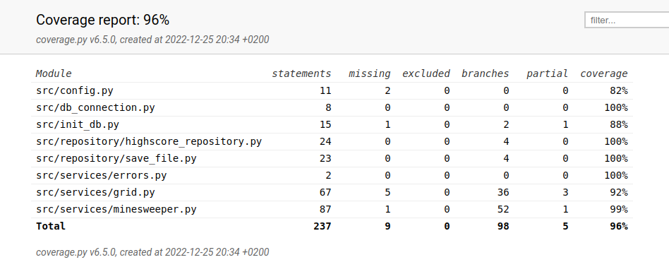

# Testausdokumentti

Ohjelmaa on testattu sekä automatisoiduin integraatio- ja yksikkötestein unittestilla sekä järjestelmätesteillä manuaalisesti.

Graafista (GUI) sekä komentorivikäyttöliittymää (CLI) on testattu järjestelmätestien yhteydessä, mutta ei automatisoiduilla testeillä.

## Yksikkö- ja integraatiotestaus

### Sovelluslogiikka

Pelilogiikasta vastaava `Minesweeper`-luokka testataan [TestMinesweeper](https://github.com/Deeroil/ot-harjoitustyo/blob/master/src/tests/services/minesweeper_test.py)-luokan avulla. Testejä varten alustetaan muutama vaihtoehtoinen `Minesweeper`-olio, mutta joissakin testeissä luodaan erillisiä olioita jotta voidaan testata [cornercases] ja erilaisia tilanteita.

`Minesweeper`-olio hyödyntää `Grid`-luokan oliota, jota käytetään peliruudukon alustamiseen, joten näiden toimintaa on testattu yhdessä. `Grid`-luokan toiminnallisuutta on testattu erikseen [TestGrid](https://github.com/Deeroil/ot-harjoitustyo/blob/master/src/tests/services/grid_test.py) -luokalla.

### Repositorio-luokat

Repositorio-luokkien `HighscoreRepository` ja `SaveFile` testaaminen ei vaikuta pelin generoimiin tiedostoihin, vaan testejä varten luodaan testitiedostot, joiden nimet on konfiguroitu .env.test-tiedostoon.

`HighscoreRepository`n testaamiseen käytetään luokkaa[TestHighscoreRepository](https://github.com/Deeroil/ot-harjoitustyo/blob/master/src/tests/repositories/highscore_repository_test.py), ja `SaveFile`-luokka testataan [TestSaveFile](https://github.com/Deeroil/ot-harjoitustyo/blob/master/src/tests/repositories/save_file_test.py)-luokalla. 

### Testauskattavuus

Haaraumakattavuus on 96 ja testaus kattaa lähes koko ohjelman. Haaraumakattavuuden ulkopuolelle on jätetty käyttöliittymäkerrokset (CLI ja UI) sekä ajotiedostot kuten index.py.

Myös esimerkiksi config.py sekä db_connection ja db_init olisi voitu jättää testauskattavuuden ulkopuolelle.
Tietokannan ja pelitallennusominaisuuden käyttö on vain UI-versiossa, eikä niiden toimintaa ole testattu erikseen komentorivikäyttöliittymästä.
Myös muutamat virhetilanteita estävät ehtolauseet ovat testaamatta luokista `Grid` ja `Minesweeper`.

## Järjestelmätestit

Ohjelman molempia versioita on testattu manuaalisesti Windowsilla ja Linuxilla (Cubbli).

### Asennus ja konfigurointi

Sovellus on otettu käyttöön ja testattu käyttöohjeiden [gui](https://github.com/Deeroil/ot-harjoitustyo/blob/master/dokumentaatio/kayttoohje.md) [cli](https://github.com/Deeroil/ot-harjoitustyo/blob/master/dokumentaatio/kayttoohje_cli.md) kuvaamilla tavoilla.

Sovelluksen konfiguimista .env-tiedoston avulla on myös testattu.

GUI-sovellusksen toiintaa on testattu voittoputkitietokannan ja pelitallennustiedoston kanssa, sekä niin että niitä ei ole ollut valmiiksi luotuina vaan sovellus on luonut ne ajon aikana.

### Toiminnallisuudet

Käyttödokumentin sekä [vaatimusmäärittelyn](https://github.com/Deeroil/ot-harjoitustyo/blob/master/dokumentaatio/vaatimusmaarittely.md) listaamat toiminnallisuudet on testattu molemmissa ohjelmissa.

Graafisen käyttöliittymän ohjelmassa on painettu kaikkia nappeja ja pelattu useampia pelejä erilaisilla tuloksilla. On myös kokeiltu esimerkiksi asettaa ruudukon avattuun ruutuun lippu.

Komentoriviohjelmassa on myös pelattu useampia pelejä ja testattu erilaisia voittotapoja, sekä yritetty syöttää virheellisiä arvoja syötteenä, kuten kirjaimia kun pyydetään numeroa, tai tyhjä merkkijono.

## Sovellukseen jääneet laatuongelmat

Sovellus ei anna järkeviä virheilmoituksia seuraavissa tilanteissa:

* tallennettaviin/luettaviin tiedostoihin ei ole luku- tai kirjoitus oikeuksia
* tietokantaa ei ole alustettu, eli `poetry run invoke build`-komentoa ei ole suoritettu ennen ensimmäistä pelikertaa